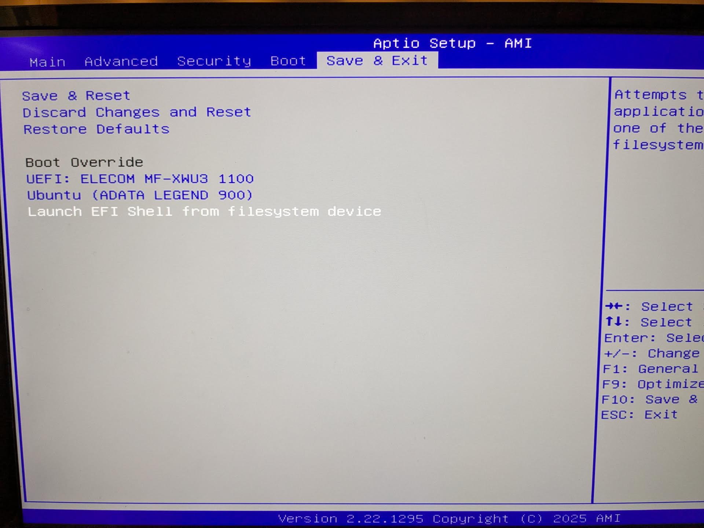
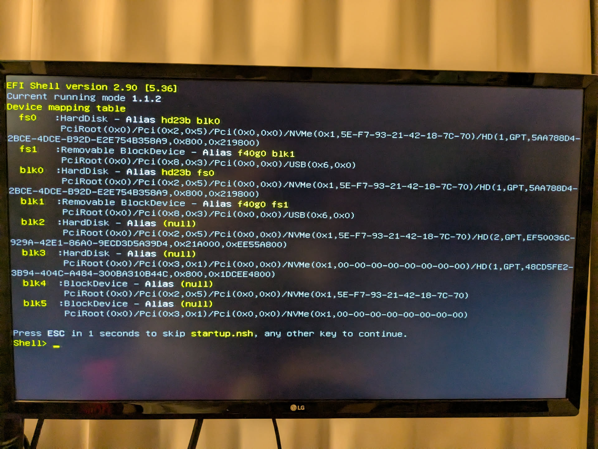
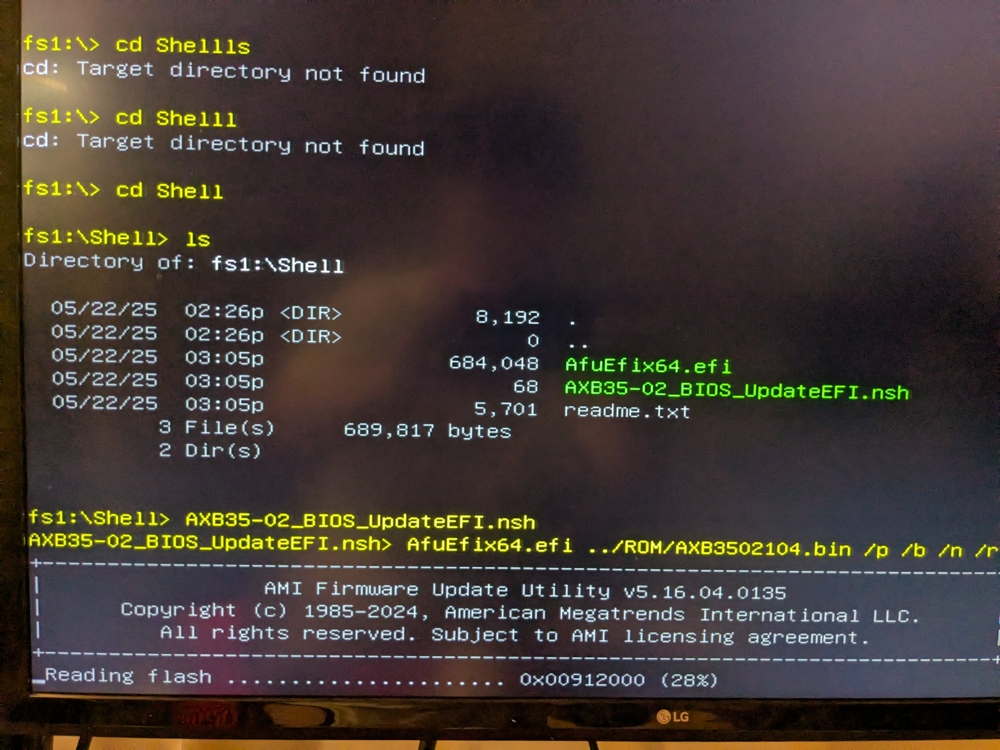
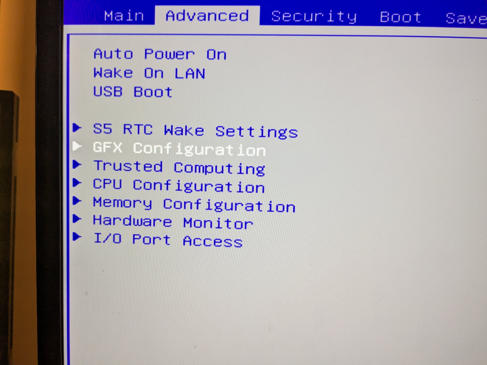
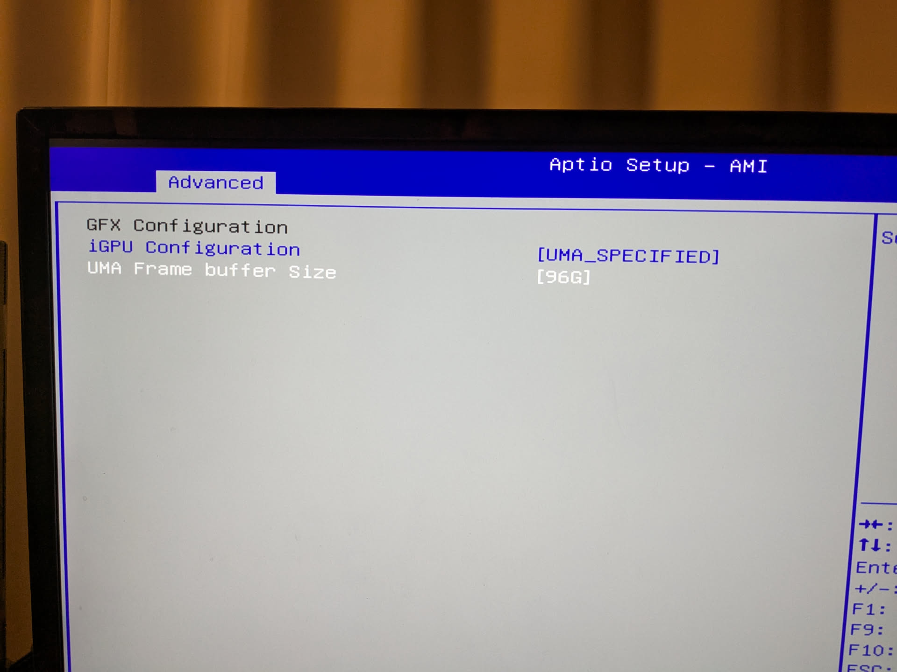

# EVO X2のBIOSアップデート(非Windows)


## 1. 別の端末でEFIブートできるUSBを用意する

1. まずUSBフラッシュメモリを用意し、FAT32でフォーマット
2. ここのファイルをダウンロードし、ルートディレクトリに放り込む
    - https://github.com/tianocore/edk2-archive/blob/master/EdkShellBinPkg/FullShell/X64/Shell_Full.efi
    - 名前をshellx64.efiと変更(これによりBIOSから起動できるようになる)
3. ここからGMKTECのBIOSアップデートイメージをダウンロードする
    -  https://www.gmktec.com/pages/drivers-and-software
4. 展開
    - なお、`AMD_Flash_BIOS_SOP.docx`はこのbiosのインストールセットアップの解説が書いてあると思いきや、関係ないBIOSのインストールガイドなので読まない
5. `ROM`ディレクトリと、`Shell`ディレクトリをそのままルートディレクトリに放り込む
    - ディレクトリ構成
    ```
    % tree
    USBフラッシュメモリルート
    ├── shellx64.efi
    ├── ROM
    │   └── AXB3502104.bin
    └── Shell
        ├── AfuEfix64.efi
        ├── AXB35-02_BIOS_UpdateEFI.nsh
        └── readme.txt
    ```
6. EVO X2にさしてBIOS起動
7. Launch EFI Shell from filesystem deviceを選択

8. 今回は`Shell> fd1:`を入力
  - `AXB35-02_BIOS_UpdateEFI.nsh`を叩きたいため、USBを選択するという意味
  - 
1. nshファイルを実行
  - cdで`Shell`の中に入りファイル名を直接指定で実行 -> biosがインストールされる
  
9. biosのアップデート中はコケたら文鎮確定なので、できるだけ揺らさないよう細心の注意を払って生活する。
  - 大体6分くらいでインストールが終わり、いきなりブチっと電源が切れる。
10. そのまま起動するとアップデートが完了しているので、BIOSに入り、`GFX configration` > `igpu configration` > `[UMA_SPECIFIED]`に変更し、`UMA Frame buffer size`を96Gに変更するとGPUメモリ割り当てを96Gにできる



