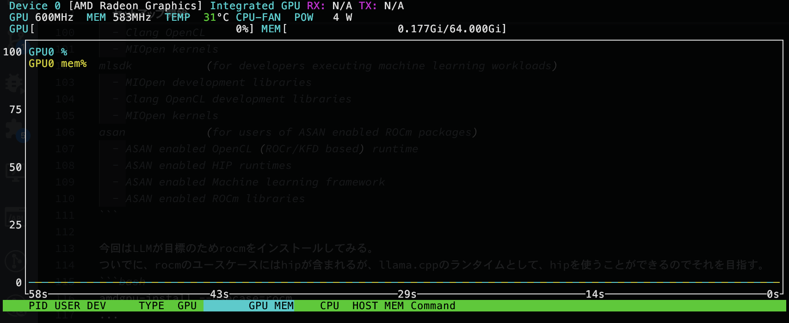

# 概要
GMKTec Evo X2を購入したが、amdgpuのセットアップが初めてなのでそのあたりの作業のメモがてらこの記事を書いた。

また、人々が欲しているLLMのベンチマークについても詳しく調査する予定(追記予定)

# 目標
AMDのGPUを使ってllama.cppを動かす！
あと、NPUはlinuxで使えるのかというところについても最善を尽くす予定。

# GMKTEC Evo X2の外観


# セットアップ開始

下記のAMDGPU installerを使うとアホの顔しててもドライバのインストールをしてくれる。なかなかやるやん。
https://rocm.docs.amd.com/projects/install-on-linux/en/develop/install/amdgpu-install.html


amdgpu installerをインストールするためにリポジトリを追加
```bash
sudo apt update
wget https://repo.radeon.com/amdgpu-install/6.4/ubuntu/noble/amdgpu-install_6.4.60400-1_all.deb
sudo apt install ./amdgpu-install_6.4.60400-1_all.deb
sudo apt update
```

`amdgpu-install --list-usecase`のコマンドでインストールする対象の一覧が表示される
dkmsは全部のバージョンに含まれるらしい。
```
amd-ai-worker1:~$ amdgpu-install --list-usecase
If --usecase option is not present, the default selection is
"dkms,graphics,opencl,hip"
Available use cases:
dkms            (to only install the kernel mode driver)
  - Kernel mode driver (included in all usecases)
graphics        (for users of graphics applications)
  - Open source Mesa 3D graphics and multimedia libraries
multimedia      (for users of open source multimedia)
  - Open source Mesa 3D multimedia libraries
workstation     (for users of legacy WS applications)
  - Open source multimedia libraries
  - Closed source (legacy) OpenGL
rocm            (for users and developers requiring full ROCm stack)
  - OpenCL (ROCr/KFD based) runtime
  - HIP runtimes
  - Machine learning framework
  - All ROCm libraries and applications
wsl             (for using ROCm in a WSL context)
  - ROCr WSL runtime library (Ubuntu 22.04 only)
rocmdev         (for developers requiring ROCm runtime and
                profiling/debugging tools)
  - HIP runtimes
  - OpenCL runtime
  - Profiler, Tracer and Debugger tools
rocmdevtools    (for developers requiring ROCm profiling/debugging tools)
  - Profiler, Tracer and Debugger tools
amf             (for users of AMF based multimedia)
  - AMF closed source multimedia library
lrt             (for users of applications requiring ROCm runtime)
  - ROCm Compiler and device libraries
  - ROCr runtime and thunk
opencl          (for users of applications requiring OpenCL on Vega or later
                products)
  - ROCr based OpenCL
  - ROCm Language runtime
openclsdk       (for application developers requiring ROCr based OpenCL)
  - ROCr based OpenCL
  - ROCm Language runtime
  - development and SDK files for ROCr based OpenCL
hip             (for users of HIP runtime on AMD products)
  - HIP runtimes
hiplibsdk       (for application developers requiring HIP on AMD products)
  - HIP runtimes
  - ROCm math libraries
  - HIP development libraries
openmpsdk       (for users of openmp/flang on AMD products)
  - OpenMP runtime and devel packages
mllib           (for users executing machine learning workloads)
  - MIOpen hip/tensile libraries
  - Clang OpenCL
  - MIOpen kernels
mlsdk           (for developers executing machine learning workloads)
  - MIOpen development libraries
  - Clang OpenCL development libraries
  - MIOpen kernels
asan            (for users of ASAN enabled ROCm packages)
  - ASAN enabled OpenCL (ROCr/KFD based) runtime
  - ASAN enabled HIP runtimes
  - ASAN enabled Machine learning framework
  - ASAN enabled ROCm libraries
```

今回はLLMが目標のためrocmをインストールしてみる。
ついでに、rocmのユースケースにはhipが含まれるが、llama.cppのランタイムとして、hipを使うことができるのでそれを目指す。
```bash
amdgpu-install --usecase=rocm
...
amd-ai-worker1:~$ sudo dkms status
amdgpu/6.12.12-2147987.24.04, 6.11.0-25-generic, x86_64: installed
```

とりあえずGPUの情報を見たい.
nvidia-smiならぬamd-smiを使うことで、確認が可能
```
amd-ai-worker1:~$ amd-smi static
GPU: 0
    ASIC:
        MARKET_NAME: AMD Radeon Graphics
        VENDOR_ID: 0x1002
        VENDOR_NAME: Advanced Micro Devices Inc. [AMD/ATI]
        SUBVENDOR_ID: 0x2014
        DEVICE_ID: 0x1586
        SUBSYSTEM_ID: 0x801d
        REV_ID: 0xc1
        ASIC_SERIAL: N/A
        OAM_ID: N/A
        NUM_COMPUTE_UNITS: 40
        TARGET_GRAPHICS_VERSION: gfx1151
```

ここまで入れたら、nvtopをapt経由でインストールすると普通に使える

厳密にはfdinfoというインターフェース経由でGPUのリソースデータが公開されているらしく、
それを使っているとのこと
```
sudo apt install nvtop
```



## NPUはどこいった？
NPUは別途ドライバをインストールする必要があり、amdgpu-installerでは対応していない模様。

下記ページにてインストール可能だが、今後の宿題である

https://github.com/amd/xdna-driver?tab=readme-ov-file#introduction


## llama.cppを動かす

こちらのhipインストールの項目より動かしてみる

https://github.com/ggml-org/llama.cpp/blob/master/docs/build.md#hip

```
git clone https://github.com/ggml-org/llama.cpp
cd llama.cpp
```

なお、HIPランタイムで実行する場合、手動でのビルドが必要。
ビルド前にcurlのdevパッケージがいる
```
sudo apt install curl libcurl4-openssl-dev
```

まず自分のiGPUの型番を調べる
```
amd-ai-worker1:~/work/llama.cpp$ rocminfo | grep gfx | head -1 | awk '{print $2}'
gfx1151
```

型番をターゲットにビルドする

ビルドは結構早い。

16コア32スレッドは伊達じゃねえ
```
HIPCXX="$(hipconfig -l)/clang" HIP_PATH="$(hipconfig -R)" \
    cmake -S . -B build -DGGML_HIP=ON -DAMDGPU_TARGETS=gfx1151 -DCMAKE_BUILD_TYPE=Release \
    && cmake --build build --config Release -- -j 16

...

#ログ
amd-ai-worker1:~/work/llama.cpp$ HIPCXX="$(hipconfig -l)/clang" HIP_PATH="$(hipconfig -R)" \
>     cmake -S . -B build -DGGML_HIP=ON -DAMDGPU_TARGETS=gfx1151 -DCMAKE_BUILD_TYPE=Release \
>     && cmake --build build --config Release -- -j 16
-- The C compiler identification is GNU 13.3.0
-- The CXX compiler identification is GNU 13.3.0
-- Detecting C compiler ABI info
-- Detecting C compiler ABI info - done
-- Check for working C compiler: /usr/bin/cc - skipped
-- Detecting C compile features
-- Detecting C compile features - done
-- Detecting CXX compiler ABI info
-- Detecting CXX compiler ABI info - done
-- Check for working CXX compiler: /usr/bin/c++ - skipped
-- Detecting CXX compile features
-- Detecting CXX compile features - done
-- Found Git: /usr/bin/git (found version "2.43.0")
-- Performing Test CMAKE_HAVE_LIBC_PTHREAD
-- Performing Test CMAKE_HAVE_LIBC_PTHREAD - Success
-- Found Threads: TRUE
-- Warning: ccache not found - consider installing it for faster compilation or disable this warning with GGML_CCACHE=OFF
-- CMAKE_SYSTEM_PROCESSOR: x86_64
-- Including CPU backend
-- Found OpenMP_C: -fopenmp (found version "4.5")
-- Found OpenMP_CXX: -fopenmp (found version "4.5")
-- Found OpenMP: TRUE (found version "4.5")
-- x86 detected
-- Adding CPU backend variant ggml-cpu: -march=native
-- The HIP compiler identification is Clang 19.0.0
-- Detecting HIP compiler ABI info
-- Detecting HIP compiler ABI info - done
-- Check for working HIP compiler: /opt/rocm-6.4.0/lib/llvm/bin/clang - skipped
-- Detecting HIP compile features
-- Detecting HIP compile features - done
CMake Warning (dev) at /opt/rocm/lib/cmake/hip/hip-config-amd.cmake:70 (message):
  AMDGPU_TARGETS is deprecated.  Please use GPU_TARGETS instead.
Call Stack (most recent call first):
  /opt/rocm/lib/cmake/hip/hip-config.cmake:149 (include)
  ggml/src/ggml-hip/CMakeLists.txt:39 (find_package)
This warning is for project developers.  Use -Wno-dev to suppress it.

-- HIP and hipBLAS found
-- Including HIP backend
-- Found CURL: /usr/lib/x86_64-linux-gnu/libcurl.so (found version "8.5.0")
-- Configuring done (1.7s)
-- Generating done (0.1s)
-- Build files have been written to: /home/amemiya/work/llama.cpp/build

...

[ 97%] Linking CXX executable ../../bin/llama-quantize
[ 97%] Built target llama-quantize
[ 97%] Linking CXX executable ../../bin/llama-cli
[ 97%] Building CXX object tools/server/CMakeFiles/llama-server.dir/server.cpp.o
[ 97%] Built target llama-cli
[ 97%] Linking CXX executable ../../bin/llama-mtmd-cli
[ 97%] Built target llama-mtmd-cli
[ 97%] Linking CXX executable ../../bin/llama-imatrix
[ 97%] Linking CXX executable ../../bin/llama-export-lora
[ 97%] Linking CXX executable ../../bin/llama-cvector-generator
[ 97%] Built target llama-imatrix
[ 97%] Built target llama-export-lora
[ 97%] Built target llama-cvector-generator
[ 97%] Linking CXX executable ../../bin/llama-perplexity
[ 97%] Built target llama-perplexity
[ 97%] Linking CXX executable ../bin/test-json-schema-to-grammar
[ 97%] Built target test-json-schema-to-grammar
[ 98%] Linking CXX executable ../../bin/llama-run
[ 98%] Built target llama-run
[ 99%] Linking CXX executable ../bin/test-chat
[ 99%] Built target test-chat
[ 99%] Linking CXX executable ../bin/test-backend-ops
[ 99%] Built target test-backend-ops
[ 99%] Linking CXX executable ../../bin/llama-bench
[ 99%] Built target llama-bench
[ 99%] Linking CXX executable ../../bin/llama-tts
[ 99%] Built target llama-tts
[100%] Linking CXX executable ../../bin/llama-server
[100%] Built target llama-server
```


llama-cliを動かして、動くか確かめる。

なお、`GGML_CUDA_ENABLE_UNIFIED_MEMORY=1`を環境変数で渡すと、unified memoryを有効化してくれるらしい（ほんとか？）
```
GGML_CUDA_ENABLE_UNIFIED_MEMORY=1  build/bin/llama-cli -ngl 29  -hf unsloth/Qwen3-0.6B-GGUF:Q8_0
```


# 失敗例

ビルドする時に、ドキュメントの環境変数をそのままぶち込んでしまった例

GPU_TARGETSがgfx1030になってしまっており、これでは動かない
```
HIPCXX="$(hipconfig -l)/clang" HIP_PATH="$(hipconfig -R)" \
    cmake -S . -B build -DGGML_HIP=ON -DAMDGPU_TARGETS=gfx1030 -DCMAKE_BUILD_TYPE=Release \
    && cmake --build build --config Release -- -j 16

# ログ
-- Warning: ccache not found - consider installing it for faster compilation or disable this warning with GGML_CCACHE=OFF
-- CMAKE_SYSTEM_PROCESSOR: x86_64
-- Including CPU backend
-- x86 detected
-- Adding CPU backend variant ggml-cpu: -march=native
CMake Warning (dev) at /opt/rocm/lib/cmake/hip/hip-config-amd.cmake:70 (message):
  AMDGPU_TARGETS is deprecated.  Please use GPU_TARGETS instead.
Call Stack (most recent call first):
  /opt/rocm/lib/cmake/hip/hip-config.cmake:149 (include)
  ggml/src/ggml-hip/CMakeLists.txt:39 (find_package)
This warning is for project developers.  Use -Wno-dev to suppress it.

-- HIP and hipBLAS found
-- Including HIP backend
-- Found CURL: /usr/lib/x86_64-linux-gnu/libcurl.so (found version "8.5.0")
-- Configuring done (0.3s)
-- Generating done (0.1s)
-- Build files have been written to: /home/amemiya/work/llama.cpp/build

......

[ 99%] Built target test-chat
[ 99%] Linking CXX executable ../bin/test-backend-ops
[ 99%] Built target test-backend-ops
[ 99%] Linking CXX executable ../../bin/llama-bench
[ 99%] Built target llama-bench
[ 99%] Linking CXX executable ../../bin/llama-tts
[ 99%] Built target llama-tts
[100%] Linking CXX executable ../../bin/llama-server
[100%] Built target llama-server
```

見た感じ、build/bin/にお目当てのバイナリがありそうなので、そこを叩く

だが、うまく動かない。


```
amd-ai-worker1:~/work/llama.cpp$ build/bin/llama-cli -ngl 29  -hf unsloth/Qwen3-0.6B-GGUF:Q8_0
ggml_cuda_init: GGML_CUDA_FORCE_MMQ:    no
ggml_cuda_init: GGML_CUDA_FORCE_CUBLAS: no
ggml_cuda_init: found 1 ROCm devices:
  Device 0: AMD Radeon Graphics, gfx1151 (0x1151), VMM: no, Wave Size: 32
curl_perform_with_retry: HEAD https://huggingface.co/unsloth/Qwen3-0.6B-GGUF/resolve/main/Qwen3-0.6B-Q8_0.gguf (attempt 1 of 1)...
common_download_file_single: using cached file: /home/amemiya/.cache/llama.cpp/unsloth_Qwen3-0.6B-GGUF_Qwen3-0.6B-Q8_0.gguf
build: 5398 (c531edfa) with cc (Ubuntu 13.3.0-6ubuntu2~24.04) 13.3.0 for x86_64-linux-gnu
main: llama backend init
main: load the model and apply lora adapter, if any
llama_model_load_from_file_impl: using device ROCm0 (AMD Radeon Graphics) - 65380 MiB free
llama_model_loader: loaded meta data with 32 key-value pairs and 310 tensors from /home/amemiya/.cache/llama.cpp/unsloth_Qwen3-0.6B-GGUF_Qwen3-0.6B-Q8_0.gguf (version GGUF V3 (latest))
llama_model_loader: Dumping metadata keys/values. Note: KV overrides do not apply in this output.
llama_model_loader: - kv   0:                       general.architecture str              = qwen3
llama_model_loader: - kv   1:                               general.type str              = model
llama_model_loader: - kv   2:                               general.name str              = Qwen3-0.6B
llama_model_loader: - kv   3:                           general.basename str              = Qwen3-0.6B
llama_model_loader: - kv   4:                       general.quantized_by str              = Unsloth
llama_model_loader: - kv   5:                         general.size_label str              = 0.6B
llama_model_loader: - kv   6:                           general.repo_url str              = https://huggingface.co/unsloth
llama_model_loader: - kv   7:                          qwen3.block_count u32              = 28
llama_model_loader: - kv   8:                       qwen3.context_length u32              = 40960
llama_model_loader: - kv   9:                     qwen3.embedding_length u32              = 1024
llama_model_loader: - kv  10:                  qwen3.feed_forward_length u32              = 3072
llama_model_loader: - kv  11:                 qwen3.attention.head_count u32              = 16
llama_model_loader: - kv  12:              qwen3.attention.head_count_kv u32              = 8
llama_model_loader: - kv  13:                       qwen3.rope.freq_base f32              = 1000000.000000
llama_model_loader: - kv  14:     qwen3.attention.layer_norm_rms_epsilon f32              = 0.000001
llama_model_loader: - kv  15:                 qwen3.attention.key_length u32              = 128
llama_model_loader: - kv  16:               qwen3.attention.value_length u32              = 128
llama_model_loader: - kv  17:                       tokenizer.ggml.model str              = gpt2
llama_model_loader: - kv  18:                         tokenizer.ggml.pre str              = qwen2
llama_model_loader: - kv  19:                      tokenizer.ggml.tokens arr[str,151936]  = ["!", "\"", "#", "$", "%", "&", "'", ...
llama_model_loader: - kv  20:                  tokenizer.ggml.token_type arr[i32,151936]  = [1, 1, 1, 1, 1, 1, 1, 1, 1, 1, 1, 1, ...
llama_model_loader: - kv  21:                      tokenizer.ggml.merges arr[str,151387]  = ["Ġ Ġ", "ĠĠ ĠĠ", "i n", "Ġ t",...
llama_model_loader: - kv  22:                tokenizer.ggml.eos_token_id u32              = 151645
llama_model_loader: - kv  23:            tokenizer.ggml.padding_token_id u32              = 151654
llama_model_loader: - kv  24:               tokenizer.ggml.add_bos_token bool             = false
llama_model_loader: - kv  25:                    tokenizer.chat_template str              = \n    {{- '<|im_start|>...
llama_model_loader: - kv  26:               general.quantization_version u32              = 2
llama_model_loader: - kv  27:                          general.file_type u32              = 7
llama_model_loader: - kv  28:                      quantize.imatrix.file str              = Qwen3-0.6B-GGUF/imatrix_unsloth.dat
llama_model_loader: - kv  29:                   quantize.imatrix.dataset str              = unsloth_calibration_Qwen3-0.6B.txt
llama_model_loader: - kv  30:             quantize.imatrix.entries_count i32              = 196
llama_model_loader: - kv  31:              quantize.imatrix.chunks_count i32              = 685
llama_model_loader: - type  f32:  113 tensors
llama_model_loader: - type q8_0:  197 tensors
print_info: file format = GGUF V3 (latest)
print_info: file type   = Q8_0
print_info: file size   = 604.15 MiB (8.50 BPW)
load: special tokens cache size = 26
load: token to piece cache size = 0.9311 MB
print_info: arch             = qwen3
print_info: vocab_only       = 0
print_info: n_ctx_train      = 40960
print_info: n_embd           = 1024
print_info: n_layer          = 28
print_info: n_head           = 16
print_info: n_head_kv        = 8
print_info: n_rot            = 128
print_info: n_swa            = 0
print_info: n_swa_pattern    = 1
print_info: n_embd_head_k    = 128
print_info: n_embd_head_v    = 128
print_info: n_gqa            = 2
print_info: n_embd_k_gqa     = 1024
print_info: n_embd_v_gqa     = 1024
print_info: f_norm_eps       = 0.0e+00
print_info: f_norm_rms_eps   = 1.0e-06
print_info: f_clamp_kqv      = 0.0e+00
print_info: f_max_alibi_bias = 0.0e+00
print_info: f_logit_scale    = 0.0e+00
print_info: f_attn_scale     = 0.0e+00
print_info: n_ff             = 3072
print_info: n_expert         = 0
print_info: n_expert_used    = 0
print_info: causal attn      = 1
print_info: pooling type     = 0
print_info: rope type        = 2
print_info: rope scaling     = linear
print_info: freq_base_train  = 1000000.0
print_info: freq_scale_train = 1
print_info: n_ctx_orig_yarn  = 40960
print_info: rope_finetuned   = unknown
print_info: ssm_d_conv       = 0
print_info: ssm_d_inner      = 0
print_info: ssm_d_state      = 0
print_info: ssm_dt_rank      = 0
print_info: ssm_dt_b_c_rms   = 0
print_info: model type       = 0.6B
print_info: model params     = 596.05 M
print_info: general.name     = Qwen3-0.6B
print_info: vocab type       = BPE
print_info: n_vocab          = 151936
print_info: n_merges         = 151387
print_info: BOS token        = 11 ','
print_info: EOS token        = 151645 '<|im_end|>'
print_info: EOT token        = 151645 '<|im_end|>'
print_info: PAD token        = 151654 '<|vision_pad|>'
print_info: LF token         = 198 'Ċ'
print_info: FIM PRE token    = 151659 '<|fim_prefix|>'
print_info: FIM SUF token    = 151661 '<|fim_suffix|>'
print_info: FIM MID token    = 151660 '<|fim_middle|>'
print_info: FIM PAD token    = 151662 '<|fim_pad|>'
print_info: FIM REP token    = 151663 '<|repo_name|>'
print_info: FIM SEP token    = 151664 '<|file_sep|>'
print_info: EOG token        = 151643 '<|endoftext|>'
print_info: EOG token        = 151645 '<|im_end|>'
print_info: EOG token        = 151662 '<|fim_pad|>'
print_info: EOG token        = 151663 '<|repo_name|>'
print_info: EOG token        = 151664 '<|file_sep|>'
print_info: max token length = 256
load_tensors: loading model tensors, this can take a while... (mmap = true)
load_tensors: offloading 28 repeating layers to GPU
load_tensors: offloading output layer to GPU
load_tensors: offloaded 29/29 layers to GPU
load_tensors:        ROCm0 model buffer size =   604.15 MiB
load_tensors:   CPU_Mapped model buffer size =   157.65 MiB
.............................................................
llama_context: constructing llama_context
llama_context: n_seq_max     = 1
llama_context: n_ctx         = 4096
llama_context: n_ctx_per_seq = 4096
llama_context: n_batch       = 2048
llama_context: n_ubatch      = 512
llama_context: causal_attn   = 1
llama_context: flash_attn    = 0
llama_context: freq_base     = 1000000.0
llama_context: freq_scale    = 1
llama_context: n_ctx_per_seq (4096) < n_ctx_train (40960) -- the full capacity of the model will not be utilized
llama_context:  ROCm_Host  output buffer size =     0.58 MiB
llama_kv_cache_unified: kv_size = 4096, type_k = 'f16', type_v = 'f16', n_layer = 28, can_shift = 1, padding = 32
llama_kv_cache_unified:      ROCm0 KV buffer size =   448.00 MiB
llama_kv_cache_unified: KV self size  =  448.00 MiB, K (f16):  224.00 MiB, V (f16):  224.00 MiB
llama_context:      ROCm0 compute buffer size =   298.75 MiB
llama_context:  ROCm_Host compute buffer size =    10.01 MiB
llama_context: graph nodes  = 1070
llama_context: graph splits = 2
common_init_from_params: setting dry_penalty_last_n to ctx_size = 4096
common_init_from_params: warming up the model with an empty run - please wait ... (--no-warmup to disable)
/home/amemiya/work/llama.cpp/ggml/src/ggml-cuda/ggml-cuda.cu:75: ROCm error
ggml_cuda_compute_forward: RMS_NORM failed
ROCm error: invalid device function
  current device: 0, in function ggml_cuda_compute_forward at /home/amemiya/work/llama.cpp/ggml/src/ggml-cuda/ggml-cuda.cu:2359
  err
Could not attach to process.  If your uid matches the uid of the target
process, check the setting of /proc/sys/kernel/yama/ptrace_scope, or try
again as the root user.  For more details, see /etc/sysctl.d/10-ptrace.conf
ptrace: Operation not permitted.
No stack.
The program is not being run.
Aborted (core dumped)
```
